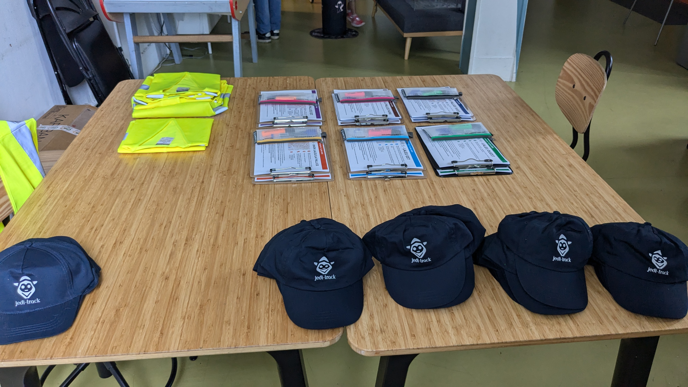
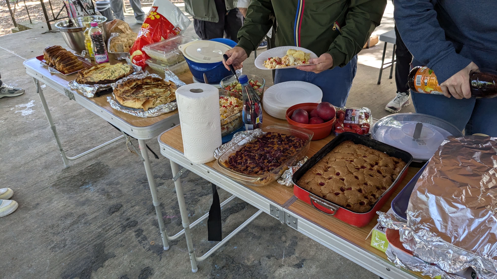

# Jedi-Track : Jeunes en Quête de Science pour les Territoires

https://jedi-track.notion.site/Trombinoscope-Les-Pacman-s-La-Rochelle-35eb2b39ef58418284dd3c3f379235e7?pvs=4

## Qui sommes-nous ?

Nous sommes un groupe de jeunes passionnés par l'environnement, les sciences et les technologies. Dans le cadre du projet **Jedi-Track** (*Jeunes en Quête de Science pour les Territoires*), nous travaillons ensemble pour améliorer la qualité de vie dans nos quartiers grâce à la science citoyenne et aux outils numériques.

Notre projet, financé par Erasmus+ et le programme "ADEI : CSTI pour toutes et tous", se déroule de janvier 2024 à juin 2025.

## Notre mission

En tant que Jedis de l'environnement, nous nous engageons à :

- 🫂 **Participer activement** à la vie de notre communauté
- ♻️ **Relever les défis environnementaux** de nos quartiers
- 🖱️ **Développer nos compétences numériques et scientifiques**
- 🔍 **Observer et collecter des données** sur notre environnement local
- 💡 **Proposer des solutions innovantes** aux problèmes identifiés

## Nos actions

### Campagne de sensibilisation au confort thermique
Pour verifier le confort thermique nous avons pendant une semaine,chacun son tours,nous avons tous pris un capteur thermique pour verifier si chez nous,c'est bien isolée. Apres cette etape nous avons effectuer une marche thermique a l'aide d'une camera thermique pour voir l'isolation des batiments de notre quartier.

### Carte citoyene sur l'accessibilité
Nous nous avons promener dans le quartier de La Palice pour reperer tout les problemes d'accisibiliter tel que les nils de poule,probleme de bateau ou bien meme des passage pietons mal placée.

Lors d'une journée festive, les jeunes du local ont invité tous les adhérents du Vents des Iles à participer à une journée de cartographie ponctué par un repas partagé au parc de Laleu.

### Découverte de la programmation et réalisation de la borne d'arcade du local
Pour commencer nous avons realisé des jeux via microsoft make code puis nous avons commencer a faire des maquettes puis dorenavent nous avons une bande arcade fonctionelle.
https://makecode.com/_ccL18Cff374x
## Carte de nos interventions

*Insérer ici une carte interactive des lieux d'intervention des jeunes*

## Qui sont les Jedis ?

### Équipe [cartographe]
- [mathis geffre-duhec] : *je suis codeur*
- [Prénom Nom] : *Courte bio et rôle dans le projet*
- [Prénom Nom] : *Courte bio et rôle dans le projet*

### Équipe [sage]
- [manon Ballester] : *Courte bio et rôle dans le projet*
- [Sébastien] : *Courte bio et rôle dans le projet*
- [Prénom Nom] : *Courte bio et rôle dans le projet*

### Équipe [agora]
- [loan] : *Courte bio et rôle dans le projet*
- [Prénom Nom] : *Courte bio et rôle dans le projet*
- [Prénom Nom] : *Courte bio et rôle dans le projet*

### Équipe [éloquence ]
- [Prénom Nom] : *Courte bio et rôle dans le projet*
- [Prénom Nom] : *Courte bio et rôle dans le projet*
- [Prénom Nom] : *Courte bio et rôle dans le projet*

## Nos partenaires
- [Nom du partenaire 1] : *Description courte du partenaire et de son rôle*
- [Nom du partenaire 2] : *Description courte du partenaire et de son rôle*
- [Nom du partenaire 3] : *Description courte du partenaire et de son rôle*

### Équipe [epicureien]
- [Alexandre] : *Courte bio et rôle dans le projet*
- [Prénom Nom] : *Courte bio et rôle dans le projet*
- [Prénom Nom] : *Courte bio et rôle dans le projet*

## Nos ressources

- [Guide de création de capteurs environnementaux DIY](lien-vers-ressource)
- [Tutoriel de cartographie participative](lien-vers-ressource)
- [Méthodologie de collecte de données](lien-vers-ressource)
- [Présentations de nos résultats](lien-vers-ressource)

## Nous contacter

- 📧 Email : [email@jedi-track.org]
- 🐦 Twitter : [@jeditrack]
- 📱 Instagram : [@jedi_track]
- 📍 Adresse : [Adresse du local principal du projet]

---

*Ce projet est financé par le programme Erasmus+ de l'Union européenne et le programme "ADEI : CSTI pour toutes et tous".*

 
