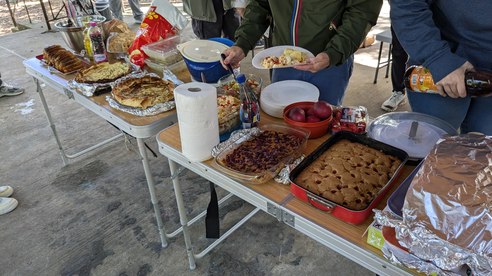

# Carte citoyene sur l'accessibilité

Lors d'une journée festive, les jeunes du local ont invité tous les adhérents du Vents des îles à participer à une journée de cartographie ponctuée par un repas partagé au parc de Laleu.

Nous nous sommes promenés dans le quartier de La Pallice et Laleu pour repérer tous les problèmes d'accessibilité tel que les nids-de-poule, les problèmes de bateau ou bien même des passages piétons mal placés :

| **Élément observé**                                     | **Détail ou précision**                                                            | **Accessibilité / Confort**                                              |
|---------------------------------------------------------|------------------------------------------------------------------------------------|---------------------------------------------------------------------------|
| 🧭 Présence d’une pente                                  | Forte, moyenne, faible                                                             | ⚠️ Risque de difficulté pour personnes à mobilité réduite                |
| 🚧 Trottoir étroit ou obstacle réducteur                | Largeur conseillée : > 1,4 m                                                       | 🚶‍♂️ Moins de confort et danger pour les PMR ou poussettes              |
| 🏞️ Chemin étroit                                        | < 60 cm (très étroit), < 1 m (étroit)                                              | 🚷 Difficulté de passage pour fauteuils ou vélos                         |
| ⚒️ Mauvais état de la chaussée                          | Fissures, trous, bosses                                                            | 🔧 Risque de chute ou gêne pour la marche                                |
| ⚠️ Revêtement difficilement praticable                  | Glissant, pavé, gravier...                                                         | ❗ Nécessite vigilance ou adaptation des déplacements                     |
| ⬆️ Marche de trottoir / ressaut                         | Rupture piétonne > 2 cm                                                            | ❌ Non franchissable sans aide pour certains                              |
| ↘️ Dévers ponctuel                                      | Pente localisée (ex : sortie de garage)                                            | ⚠️ Risque de déséquilibre ou glissade                                    |
| ♿ Rampe d’accessibilité PMR                             | ✔️ Avec ou ❌ sans garde-corps                                                     | ✅ Recommandée pour sécuriser les accès                                  |
| 🛑 Passage piéton sans bateau                           | Bordure non abaissée                                                               | ❌ Obstacle pour les personnes en fauteuil ou avec poussette             |
| ⚪ Marquage au sol dégradé                              | Peinture effacée ou peu visible                                                    | ❌ Moins de sécurité visuelle pour les piétons                           |
| 🚷 Absence de bande de guidage                         | Aucune bande podotactile                                                           | ❌ Difficulté d’orientation pour les personnes malvoyantes               |
| 🚗 Stationnement à cheval sur le trottoir              | Véhicules empiètent sur l’espace piéton                                            | 🚫 Réduction de la largeur utile du trottoir                             |
| 🗑️ Poubelles privées sur le trottoir                    | Positionnement gênant                                                              | ❗ Obstacle ponctuel non réglementé                                      |
| 🪑 Bancs publics                                        | Présents ou absents                                                                | ✅ Lieu de repos pour tous                                               |
| 🐶 Distributeur de sacs de déjections canines          | Spécifier présence ou absence de poubelle adjacente                                | ♻️ Encourage la propreté de l’espace public                              |
| 🚮 Poubelles publiques                                  | Spécifier présence de poubelles de recyclage                                       | ✅ Gestion des déchets améliorée                                         |
| 🧺 Tables de pique-nique                                | Présentes ou absentes                                                              | ✅ Aire de repos conviviale                                              |
| 🧒 Zones de jeux pour enfants                          | Présence, état et accessibilité                                                    | ✅ Lieux de détente familiale                                            |
| 🚌 Arrêt de bus                                         | Avec ou sans banc                                                                  | ✅ Attente confortable si banc présent                                   |

Cette journée nous a permis de créer une carte interactive pour repérer les problèmes d’accessibilité dans le quartier, disponible sur uMap, un outil open source pratique pour tous les habitants.

|  |  |  |
|------------------------------|------------------------------|----------------------------------|
|  |  |                                  |
