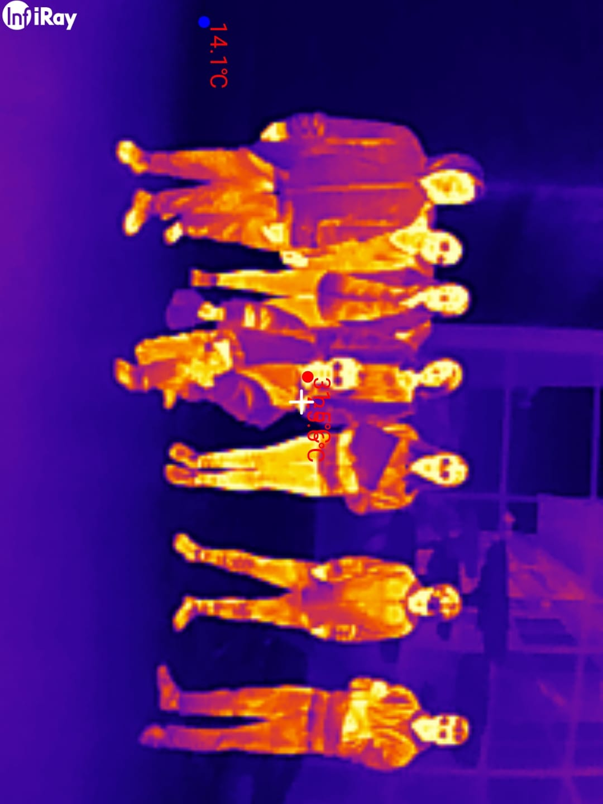

# Campagne de sensibilisation au confort thermique

Pour vérifier le confort thermique, nous avons, pendant une semaine, chacun notre tour, pris un capteur thermique pour vérifier si, chez nous, c'était bien isolé. 

Nous avons ensuite croisé ces informations avec nos ressentis sur notre confort dans différentes pièces de la maison (chambre, cuisine, salle de bain...) grâce à un questionnaire.

## 🔍 Questionnaire « Confort thermique »

**Nom de Jedi** :

**Dates d’étude** : du ..../..../2025 au ..../..../2025

### 📅 Collecte journalière

**Jour choisi** : ..../..../2025

**Position du capteur** *(par exemple : chambre, séjour, cuisine, proche d’une fenêtre, proche du point de chaleur...)* :

| Heure  | Température 🌡️ | Humidité 💧 |
|--------|-------------|----------|
| 00h    |             |          |
| 01h    |             |          |
| 02h    |             |          |
| 03h    |             |          |
| 04h    |             |          |
| 05h    |             |          |
| 06h    |             |          |
| 07h    |             |          |
| 08h    |             |          |
| 09h    |             |          |
| 10h    |             |          |
| 11h    |             |          |
| 12h    |             |          |
| 13h    |             |          |
| 14h    |             |          |
| 15h    |             |          |
| 16h    |             |          |
| 17h    |             |          |
| 18h    |             |          |
| 19h    |             |          |
| 20h    |             |          |
| 21h    |             |          |
| 22h    |             |          |
| 23h    |             |          |

**Échelles indicatives :**

- Températures : 15°C, 17°C, 19°C, 21°C, 23°C, 25°C  
- Humidité : 0%, 20%, 40%, 60%, 80%, 100%

### 📈 Collecte sur 7 jours – Moyennes journalières

| Jour | Température | Humidité | Confort ressenti |
|------|-------------|----------|------------------|
| J1   |             |          | 😕 Inconfort (bruit, froid...) |
| J2   |             |          | 🙂 Acceptable, mais améliorable |
| J3   |             |          | 😌 Confortable (calme, bonne T°) |
| J4   |             |          | 🤔 Variables (trop chaud la nuit, lumineux le matin) |
| J5   |             |          | 🥱 Fatigant (air sec, trop chaud) |
| J6   |             |          | 😃 Très bon confort général |
| J7   |             |          | 😍 Excellente qualité de vie |

### 📝 Observations

(par exemple : modification de la position du capteur, événements extérieurs...)

---

Après cette étape, nous avons effectué une marche thermique à l'aide d'une caméra thermique pour voir l'isolation des bâtiments de notre quartier.

